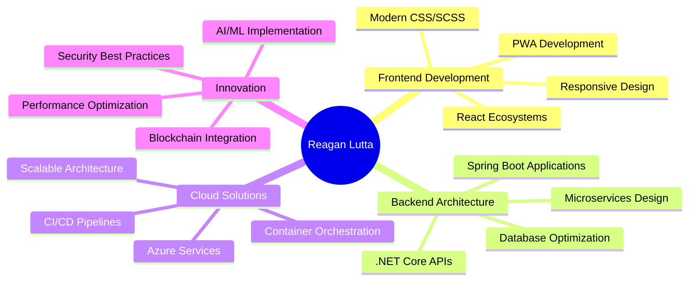

<div align="center">

<!-- Animated Name -->


<br/>


</div>

---

<div align="center">

## 🎯 **Transforming Ideas Into Digital Reality**

*Passionate full-stack developer with extensive freelancing experience, now crafting enterprise-level solutions. I architect seamless user experiences and build robust, scalable backends that power tomorrow's innovations.*

</div>

<div align="center">
  
  [](https://www.linkedin.com/in/reagan-lutta-115919211/)
  [](https://twitter.com/LuttaMd)
  [](https://reagan27.github.io/Reagan-DevPortfolio/)
  
</div>

---

## 🚀 **Tech Arsenal**

<div align="center">

### 🎨 **Frontend Mastery**


### ⚡ **Backend Excellence**


### 🗄️ **Database Wizardry**


### ☁️ **Cloud & DevOps**


### 🔐 **Security & Architecture**


</div>

---

## 📊 **GitHub Analytics**

<div align="center">
  
  
</div>

<div align="center">
  
</div>

---

## 🎯 **Core Competencies**

<div align="center">



</div>

---

## 🌟 **What Sets Me Apart**

<table align="center">
<tr>
<td align="center" width="33%">

**🎨 Creative Problem Solver**
<br>
*Transforming complex business requirements into elegant, user-friendly solutions*

</td>
<td align="center" width="33%">

**⚡ Performance Optimizer**
<br>
*Building lightning-fast applications that scale seamlessly with user growth*

</td>
<td align="center" width="33%">

**🔒 Security Advocate**
<br>
*Implementing robust security measures following OWASP guidelines and best practices*

</td>
</tr>
</table>

---

## 🎪 **Current Focus Areas**

<div align="center">

| 🚀 **Enterprise Solutions** | 🌐 **Modern Web Apps** | 🔗 **Blockchain Integration** | ☁️ **Cloud Architecture** |
|:---:|:---:|:---:|:---:|
| Spring Boot microservices | React + TypeScript SPAs | Smart contract development | Azure-native solutions |
| PostgreSQL optimization | Progressive Web Apps | DeFi protocol integration | Kubernetes orchestration |
| RESTful API design | Real-time applications | Cryptocurrency platforms | CI/CD automation |

</div>

---

## 📈 **Professional Journey**

<div align="center">

```ascii
    2019        2021        2023        2025
     |           |           |           |
 Freelancer → Full-Stack → Team Lead → Architect
     |           |           |           |
   Learning   Mastering   Teaching   Innovating
```

</div>

---

## 🎓 **Knowledge Sharing**

<div align="center">

### 📝 [**Lutta's Techfolio**](https://reagan27.github.io/Reagan-DevPortfolio/)

*Deep dives into system architecture, database optimization, security implementations, and cutting-edge technologies*

**Popular Topics:**
- 🏗️ Microservices Architecture Patterns
- 🔐 Advanced Security Implementations  
- 📊 Database Performance Tuning
- ☁️ Cloud-Native Development
- 🚀 Modern DevOps Practices

</div>

---

## 🤝 **Let's Build Something Amazing**

<div align="center">

**Ready to transform your ideas into reality?**

[](mailto:reaganlutta@email.com)
[](https://www.linkedin.com/in/reagan-lutta-115919211/)
[](https://twitter.com/LuttaMd)

*"Code is poetry written in logic, and every project is a masterpiece waiting to be crafted."*

**🌟 Always curious, forever coding, constantly innovating! 🚀**

</div>

---

<div align="center">
  
</div>
